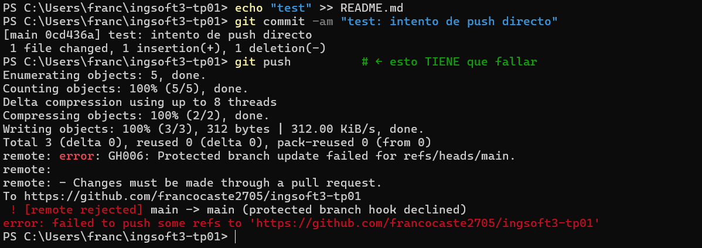
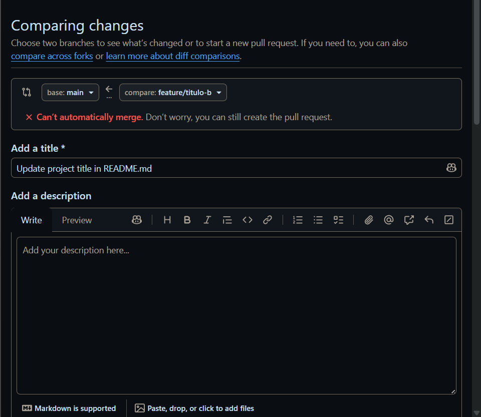
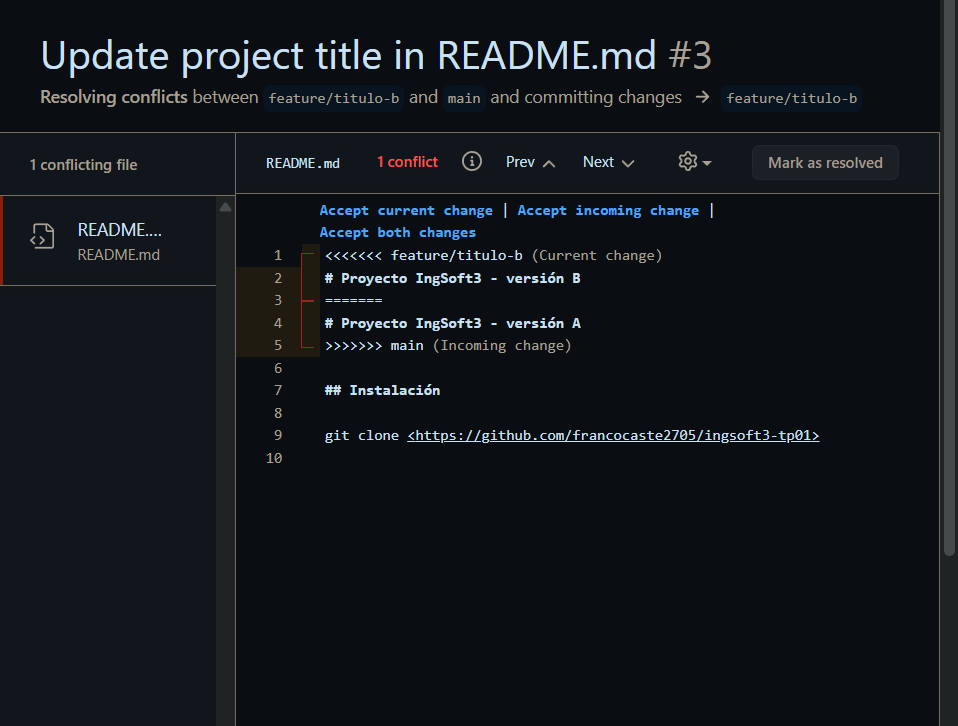
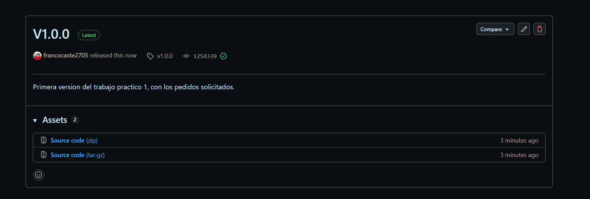

# Evidencias — TP1

## 1. Push directo a main rechazado

Intento un `git push` directo a `main` después de commitear un cambio en el `README.md`. GitHub
lo rechaza con `remote: error: GH006: Protected branch update failed for refs/heads/main` y
`! [remote rejected] main -> main (protected branch hook declined)`, porque la rama está
protegida y esa protección alcanza también al dueño del repositorio.

## 2. Aviso de conflicto en el Pull Request

Al comparar la rama `feature/titulo-b` contra `main` para crear el Pull Request, GitHub muestra
el mensaje **"Can't automatically merge"**, indicando que hay un conflicto que debe resolverse
antes de poder mergear.

## 3. Marcadores de conflicto en el archivo

Dentro del editor de resolución de conflictos del PR, el `README.md` muestra los marcadores
`<<<<<<< feature/titulo-b (Current change)`, `=======` y `>>>>>>> main (Incoming change)`
delimitando las dos versiones en conflicto de la primera línea del archivo ("versión B" vs
"versión A"), antes de decidir cuál contenido queda y borrar los marcadores.

## 4. Release publicada

La release **v1.0.0**, marcada como *Latest*, publicada sobre el tag `v1.0.0` con sus notas
("Primera version del trabajo practico 1, con los pedidos solicitados.") y sus dos assets de
código fuente (`.zip` y `.tar.gz`) generados automáticamente por GitHub.
