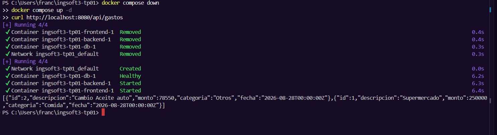
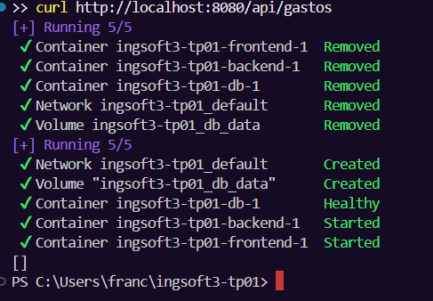
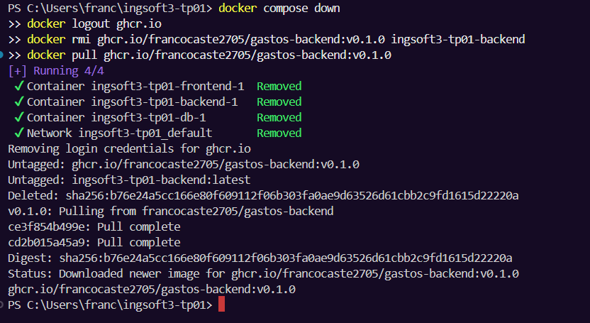
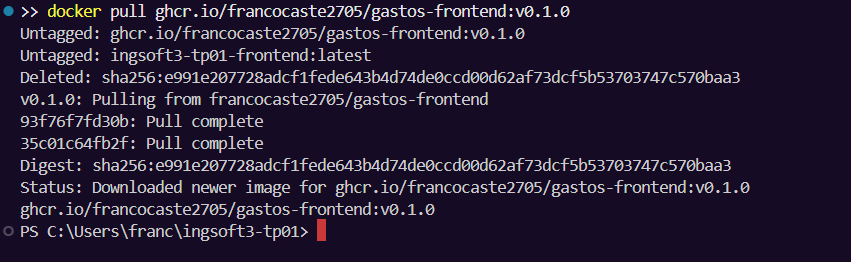
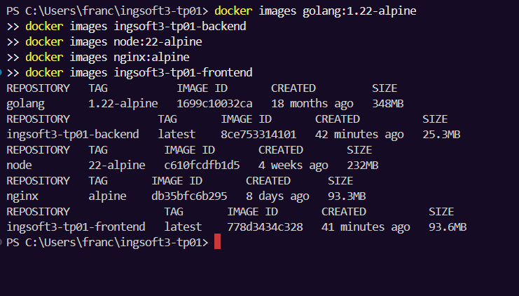
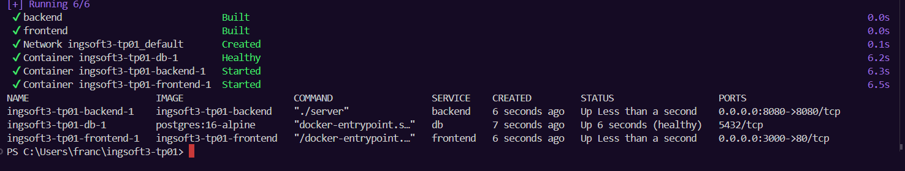

# Evidencias — TP1

## 1. Push directo a main rechazado

Intento un `git push` directo a `main` después de commitear un cambio en el `README.md`. GitHub
lo rechaza con `remote: error: GH006: Protected branch update failed for refs/heads/main` y
`! [remote rejected] main -> main (protected branch hook declined)`, porque la rama está
protegida y esa protección alcanza también al dueño del repositorio.

## 2. Aviso de conflicto en el Pull Request

Al comparar la rama `feature/titulo-b` contra `main` para crear el Pull Request, GitHub muestra
el mensaje **"Can't automatically merge"**, indicando que hay un conflicto que debe resolverse
antes de poder mergear.

## 3. Marcadores de conflicto en el archivo

Dentro del editor de resolución de conflictos del PR, el `README.md` muestra los marcadores
`<<<<<<< feature/titulo-b (Current change)`, `=======` y `>>>>>>> main (Incoming change)`
delimitando las dos versiones en conflicto de la primera línea del archivo ("versión B" vs
"versión A"), antes de decidir cuál contenido queda y borrar los marcadores.

## 4. Release publicada

La release **v1.0.0**, marcada como *Latest*, publicada sobre el tag `v1.0.0` con sus notas
("Primera version del trabajo practico 1, con los pedidos solicitados.") y sus dos assets de
código fuente (`.zip` y `.tar.gz`) generados automáticamente por GitHub.

## TP2 — Contenedores

## 5. Prueba de persistencia — los datos sobreviven a `down`/`up`

Después de `docker compose down` seguido de `docker compose up -d`, el `curl` a
`/api/gastos` sigue devolviendo los gastos cargados previamente. Esto confirma que los
contenedores son efímeros pero el volumen `db_data` —donde vive PostgreSQL— sobrevive a su
destrucción.

## 6. Prueba de persistencia — `down -v` limpia los datos

Corriendo `docker compose down -v` (que borra también los volúmenes) seguido de
`docker compose up -d`, el `curl` a `/api/gastos` devuelve `[]`: la base nació vacía porque el
volumen fue eliminado junto con el contenedor.

## 7. Imagen del backend publicada en el registry

La imagen `ghcr.io/francocaste2705/gastos-backend:v0.1.0`, con visibilidad pública, verificada
bajándola con `docker pull` estando deslogueado (`docker logout ghcr.io` previo al `pull`).

## 8. Imagen del frontend publicada en el registry

La imagen `ghcr.io/francocaste2705/gastos-frontend:v0.1.0`, con visibilidad pública, verificada
de la misma forma que el backend.

## 9. Comparación de tamaño: imagen final vs imagen de SDK/build

| Imagen | Rol | Tamaño |
|---|---|---|
| `golang:1.22-alpine` | Compila el backend (SDK completo) | 348MB |
| `ingsoft3-tp01-backend` | Backend en producción (solo el binario) | 25.3MB |
| `node:22-alpine` | Compila el frontend (Node + npm) | 232MB |
| `nginx:alpine` | Base del frontend en producción | 93.3MB |
| `ingsoft3-tp01-frontend` | Frontend en producción (nginx + estáticos) | 93.6MB |

El backend final es aproximadamente **14 veces más chico** que la imagen que lo compila, porque
no viaja ningún compilador ni herramienta de build — solo el binario ya compilado sobre
`alpine:3.20`. El frontend final queda casi del mismo tamaño que `nginx:alpine` puro (93.6MB vs
93.3MB), porque los estáticos generados por `vite build` pesan apenas unos KB — la reducción real
está en que toda la etapa de Node con sus `node_modules` (varios cientos de MB) nunca llega a la
imagen de producción.

## 10. Sistema completo funcionando end-to-end

`docker compose up -d --build` levantando los tres servicios desde cero (`db` healthy,
`backend` y `frontend` corriendo), con la aplicación funcionando en `http://localhost:3000`:
alta de un gasto reflejada en la lista y en el total.
